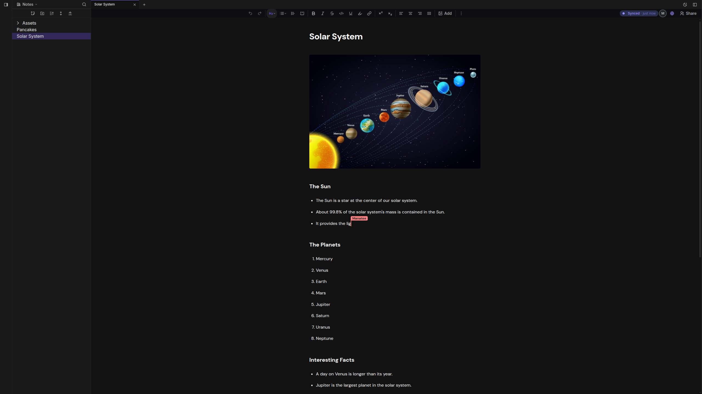

<div align="center">

# Synk

**Local-first, real-time collaborative note editor. Your documents live on your device, not on someone else's server.**

[](./LICENSE)
[](#-status-alpha)

[Live demo](https://app.synk.md) · [Roadmap](./ROADMAP.md)

</div>

---

> ### ⚠️ Status: alpha
>
> Synk works, but it is an early experiment, not a finished product. **Do not store sensitive or important data in it yet.** Two things in particular you should know before you use it:
>
> - **There is no access control.** Anyone who has a share link can read *and* edit that note. Sharing is secured only by the link being hard to guess. Treat a share link like a public URL.
> - **Your notes live only in your browser.** If you clear your browser data, they are gone. Export anything you want to keep.
>
> See [Known limitations](#known-limitations) for the full picture. These are being worked on; see the [Roadmap](./ROADMAP.md).

---

## What is Synk?

Synk is a rich-text (WYSIWYG) note editor that is **local-first and real-time collaborative at the same time**, a combination most tools make you choose between.

Synk sits in the gap. You edit locally with no spinners and no account, your data stays on your machine, and when you choose to collaborate, edits sync directly between browsers over an encrypted peer-to-peer connection. No central server ever holds your document content.

It's built for people who want to work together and keep control of their data.

## Screenshot

<!-- Replace with a real screenshot or, better, a short GIF of two windows editing the same note live. A demo GIF is the single most persuasive thing you can put here. -->



## Features

- **Rich-text editing.** Headings, bold, italic, lists, links, and more (built on TipTap / ProseMirror).
- **Real-time collaboration.** Multiple people edit the same note simultaneously, with live cursors and presence.
- **Local-first.** Every note is stored on your device in the browser (IndexedDB). Works fully offline; syncs when peers reconnect.
- **Peer-to-peer sync.** Edits travel directly between browsers over encrypted WebRTC channels. No document server in the middle.
- **Conflict-free merging.** Concurrent edits merge automatically with no lost work, powered by CRDTs (Yjs).
- **Notebooks and notes.** Organize notes into nested folders and notebooks.
- **Markdown export.** Export any note to standard Markdown so your content is never locked in.
- **No account, no install.** Runs in a modern web browser.

## How it works

Synk glues together a stack of proven local-first building blocks:

| Layer | Technology |
|---|---|
| Editor | [TipTap](https://tiptap.dev) on top of [ProseMirror](https://prosemirror.net) |
| Shared state | [Yjs](https://yjs.dev) CRDT (`Y.Doc` per note) |
| Networking | [y-webrtc](https://github.com/yjs/y-webrtc), peer-to-peer over WebRTC |
| Persistence | [y-indexeddb](https://github.com/yjs/y-indexeddb), local storage in the browser |
| Signaling | A small, stateless signaling server (used only to help peers find each other) |

The signaling server helps two browsers discover each other and then gets out of the way. It never sees or stores your document content. Once a peer-to-peer connection is established, all edits flow directly between browsers, encrypted end-to-end by WebRTC (DTLS).

## Getting started

### Prerequisites

- [Node.js](https://nodejs.org) >= 18
- [pnpm](https://pnpm.io) (managed via corepack)

```bash
npm install --global corepack@latest
corepack enable pnpm
corepack use pnpm@latest-10
```

### Clone (with submodules)

Synk depends on a vendored fork of TipTap included as a git submodule, so clone recursively:

```bash
git clone --recursive git@github.com:synk-md/synk.git
cd synk
```

If you already cloned without `--recursive`, pull the submodule in:

```bash
git submodule update --init
```

### Install

Build the vendored TipTap fork first, then install the app:

```bash
pushd vendor/tiptap
pnpm install
pnpm run build
popd

pnpm install
```

> **Note:** `pnpm run build` can exhaust the JS heap. If you hit an out-of-memory error, raise the limit first:
>
> ```bash
> # Linux / macOS
> export NODE_OPTIONS="--max-old-space-size=8192 --heapsnapshot-near-heap-limit=3"
>
> # Windows
> set NODE_OPTIONS=--max-old-space-size=8192 --heapsnapshot-near-heap-limit=3
> ```

### Development

Run the app locally with hot reload:

```bash
pnpm dev
```

Then open the URL printed in your terminal. To collaborate across different machines you'll need a reachable signaling server (see below).

### Configuring the signaling server

Synk connects to a signaling server to establish peer connections. A sensible public default is included, so it works out of the box. To point Synk at your own server, set an environment variable:

```bash
# .env
VITE_SIGNALING_URL=wss://your-signaling-server.example.com
```

## Known limitations

Synk is an alpha. These are the things it does **not** do yet, stated plainly so you can decide whether it fits your use:

- **No access control.** Anyone with a share link can read and edit the note. There is no authentication, no permissions, and no way to remove a collaborator. Security rests entirely on the share link being secret. **Do not share anything you wouldn't be comfortable making public.**
- **No backup; data can be lost.** Notes live only in your browser's local storage. Clearing browser data, or uninstalling, deletes them. Export important notes to Markdown to keep them safe.
- **No single-user cross-device sync.** There's no built-in way to sync your own notes between your laptop and phone. Devices must be online at the same time to sync via collaboration.
- **Connectivity can fail on restrictive networks.** Peer-to-peer connections may not establish behind strict corporate or university firewalls, because there is no TURN relay fallback yet.
- **Designed for small groups.** The peer-to-peer mesh is intended for small teams (roughly up to 10 collaborators per note). It is not built to scale beyond that.

## Roadmap

See [Roadmap](https://synk.md/roadmap).

## Contributing

Contributions are very welcome. This is a young project and there's a lot of approachable work.

## License

Copyright (C) 2026 Sindre Frantzen Dalvik

See [`LICENSE`](./LICENSE).
